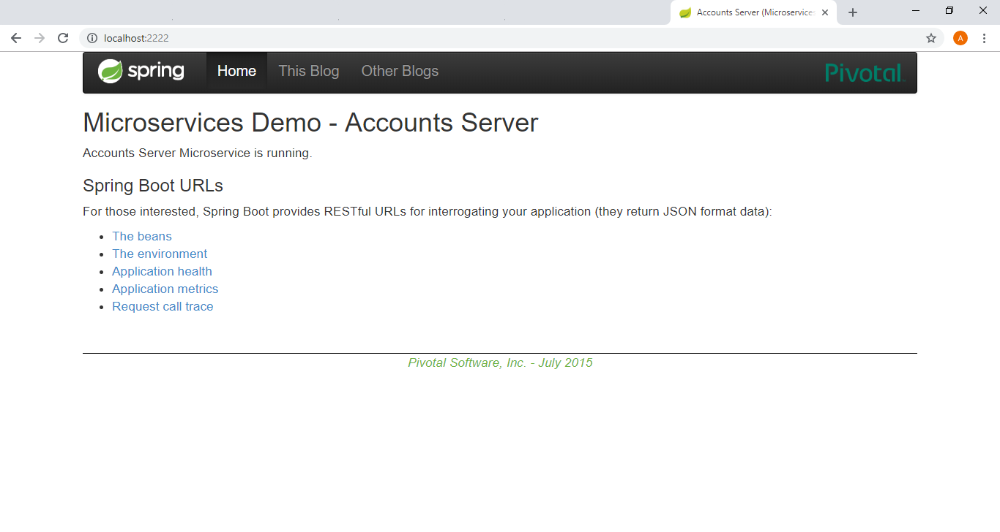
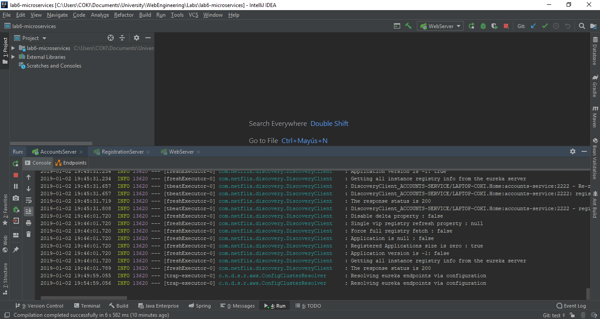
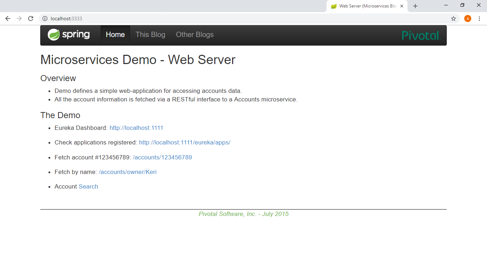
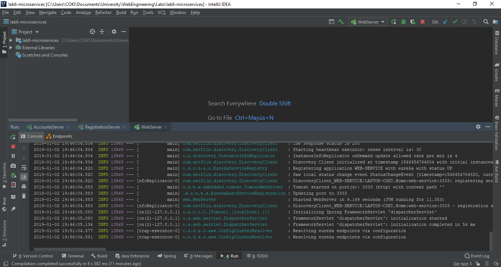
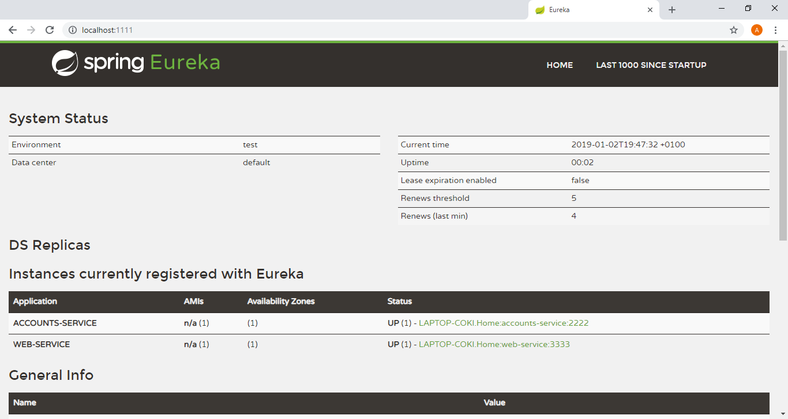
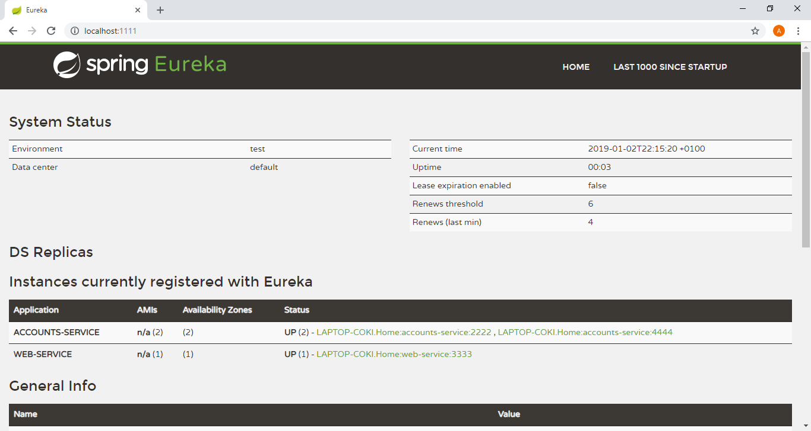
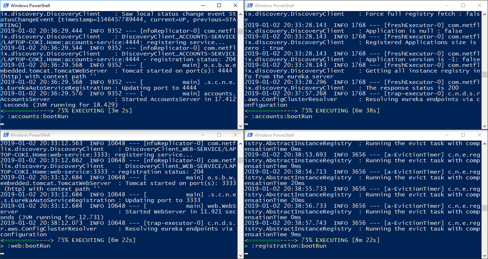

# The two microservices are running and registered (two terminals, logs screenshots) and service registration service has the two microservices registered (a third terminal, dashboard screenshots)
Description | Web interface |  Logs
:-------------------------:|:-------------------------:|:-------------------------:
Account microservice |  | 
Web microservice |  | 
Eureka server |  | 

# A second account microservice is running in the port 4444 and it is registered (a fourth terminal, log screenshots).
To accomplish that, the [application.yml](./accounts/src/main/resources/application.yml) file of the account microservice was modified.

Web interface |  Logs
:-------------------------:|:-------------------------:
 | 

# A brief report describing what happens when you kill the microservice with port 2222. Can the web service provide information about the accounts? Why?
Yes, the web service still provide information about the accounts because the second account microservice will replace the first one as you can see below.

